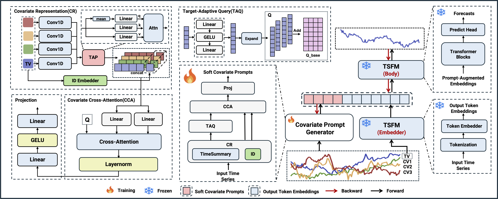

# CUE-TS: Soft Covariate Prompts for Time-Series Models

Official release of CUE-TS.

---

## Pretrained Model

Download TimeMoE-50M from HuggingFace:  
https://huggingface.co/Maple728/TimeMoE-50M

Place the downloaded files here:

    pretrained_models/TimeMoE-50M/

---

## Dataset

Place your dataset here:

    datasets/NP.csv

(Default: the last column is the target; others are covariates.)

---

## Training

First time only (make the script executable):

    chmod +x scripts/train_cuets.sh

Run training:

    ./scripts/train_cuets.sh

---

## Model Architecture

  

---

## License

MIT License
